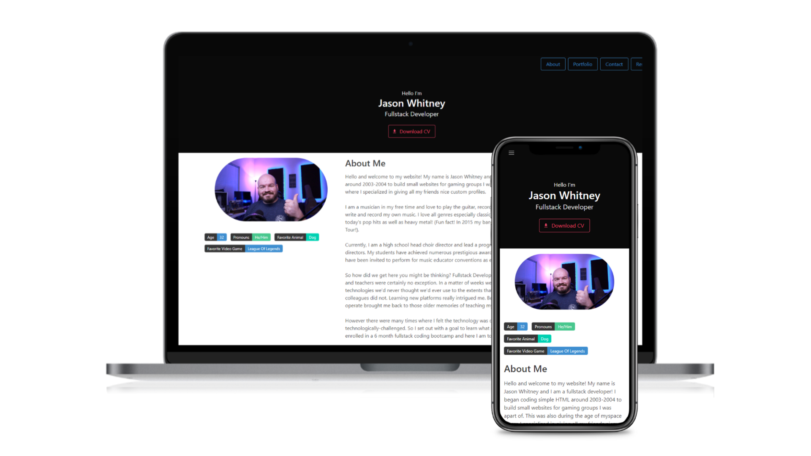

<h2 align="center">
  React Portfolio Website 
  <a href="https://jwhitney2209.github.io/my-react-portfolio/" target="_blank">JWHIT</a>
</h2>

  

 

## Built With

My personal portfolio <a href="https://jwhitney2209.github.io/my-react-portfolio/" target="_blank">JWHIT</a> which features some of my github projects as well as my resume and technical skills. 

This project was built using these technologies.

- React.js
- Node.js
- Bulma
- CSS
- VsCode
- Framer Motion

## Features

**📖 Multi-Page Layout**

**🎨 Styled with Bulmas**

**📱 Fully Responsive**

## Getting Started

Clone down this repository. You will need `node.js` and `git` installed globally on your machine.

## 🛠 Installation and Setup Instructions

1. Installation: `npm install`

2. In the project directory, you can run: `npm start`

Runs the app in the development mode.\
Open [http://localhost:3000](http://localhost:3000) to view it in the browser.
The page will reload if you make edits.